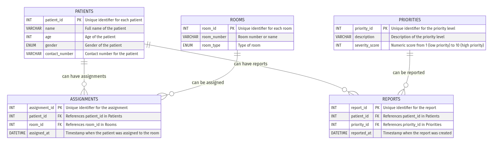

# Hospital Triage Database Design

## Entities and Attributes

### 1. Patients
- **Attributes:**
  - `patient_id` (INT, PRIMARY KEY, AUTO_INCREMENT): Unique identifier for each patient.
  - `name` (VARCHAR(100), NOT NULL): Full name of the patient.
  - `age` (INT, NOT NULL): Age of the patient.
  - `gender` (ENUM('Male', 'Female', 'Other'), NOT NULL): Gender of the patient.
  - `contact_number` (VARCHAR(15), NULL): Contact number for the patient.

### 2. Priorities
- **Attributes:**
  - `priority_id` (INT, PRIMARY KEY, AUTO_INCREMENT): Unique identifier for the priority level.
  - `description` (VARCHAR(255), NOT NULL): Description of the priority level (e.g., critical, moderate).
  - `severity_score` (INT, NOT NULL): Numeric score from 1 (low priority) to 10 (high priority).

### 3. Rooms
- **Attributes:**
  - `room_id` (INT, PRIMARY KEY, AUTO_INCREMENT): Unique identifier for each room.
  - `room_number` (VARCHAR(10), NOT NULL): Room number or name.
  - `room_type` (ENUM('ICU', 'General', 'Isolation'), NOT NULL): Type of room.

### 4. Assignments (Relationship between Patients and Rooms)
- **Attributes:**
  - `assignment_id` (INT, PRIMARY KEY, AUTO_INCREMENT): Unique identifier for the assignment.
  - `patient_id` (INT, FOREIGN KEY): References `patient_id` in Patients.
  - `room_id` (INT, FOREIGN KEY): References `room_id` in Rooms.
  - `assigned_at` (DATETIME, NOT NULL): Timestamp when the patient was assigned to the room.

### 5. Reports (Relationship between Patients and Priorities)
- **Attributes:**
  - `report_id` (INT, PRIMARY KEY, AUTO_INCREMENT): Unique identifier for the report.
  - `patient_id` (INT, FOREIGN KEY): References `patient_id` in Patients.
  - `priority_id` (INT, FOREIGN KEY): References `priority_id` in Priorities.
  - `reported_at` (DATETIME, NOT NULL): Timestamp when the report was created.

## Entity-Relationship Diagram (ERD)

## Notes
- Relationships:
  - **Patients to Rooms**: Many-to-One (a patient can be assigned to one room).
  - **Patients to Priorities**: Many-to-One (a patient can have one priority at a time).
- Foreign Keys:
  - `patient_id` in Assignments and Reports references `patient_id` in Patients.
  - `room_id` in Assignments references `room_id` in Rooms.
  - `priority_id` in Reports references `priority_id` in Priorities.
